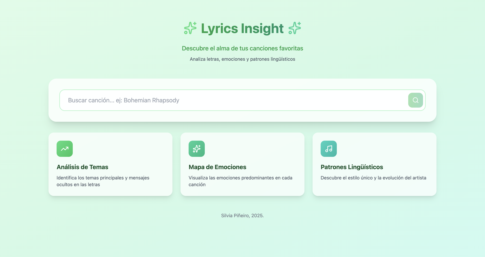

# Lyrics Insight 🎵

**Lyrics Insight** es una aplicación web diseñada para analizar las letras de tus canciones favoritas utilizando Inteligencia Artificial. La aplicación no solo muestra la letra de las canciones, sino que analiza los temas, emociones y patrones lingüísticos de la misma.

## ✨ Características Principales

*   **Buscador de Canciones**: Integración con la **API de Genius** para encontrar cualquier canción.
*   **Visualización de Letras**: Muestra la letra completa de la canción seleccionada.
*   **Análisis con IA (Powered by Google Gemini)**:
    *   **Vibe**: Un resumen en una frase del sentimiento general de la canción.
    *   **Mapa de Emociones**: Gráficos de barras horizontales que muestran el porcentaje de emociones como alegría, tristeza, energía, nostalgia, amor, esperanza, etc.
    *   **Temas Principales**: Etiquetas con los tópicos recurrentes en la letra.
    *   **Patrones Lingüísticos**: Un análisis breve sobre el estilo, rimas y metáforas utilizadas por el artista.
*   **Interfaz**: Construida con **React** y **Tailwind CSS**.

## 🛠 Tecnologías

*   **Frontend**: React (Vite), Tailwind CSS, Lucide React (iconos).
*   **Backend**: Vercel Serverless Functions (Node.js).
*   **APIs Externas**:
    *   [Genius API](https://docs.genius.com/): Para búsqueda de metadatos y scraping de letras.
    *   [Google Gemini API](https://ai.google.dev/): Modelo `gemini-2.0-flash` para el análisis semántico y emocional.

## 🚀 Configuración Local

1.  **Clonar el repositorio** y entrar en la carpeta.
2.  **Instalar dependencias**:
    ```bash
    npm install
    ```
3.  **Configurar Variables de Entorno**:
    Crea un archivo `.env` en la raíz con las siguientes claves:
    ```env
    GENIUS_API_KEY=tu_token_de_genius
    GEMINI_API_KEY=tu_api_key_de_google
    ```
4.  **Ejecutar en desarrollo**:
    ```bash
    vercel dev
    ```

## 📝 Capturas




---
Desarrollado con ❤️ por Silvia Piñeiro, 2025.
